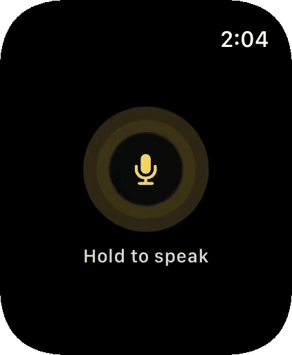
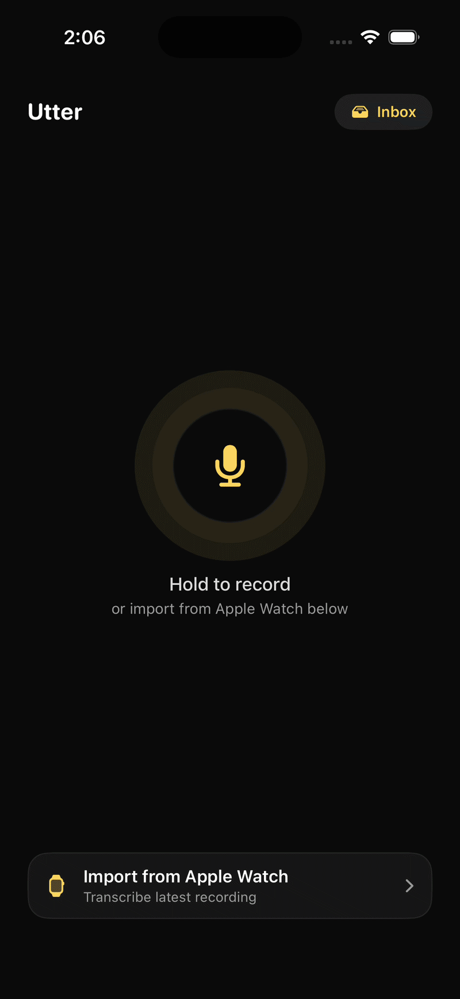
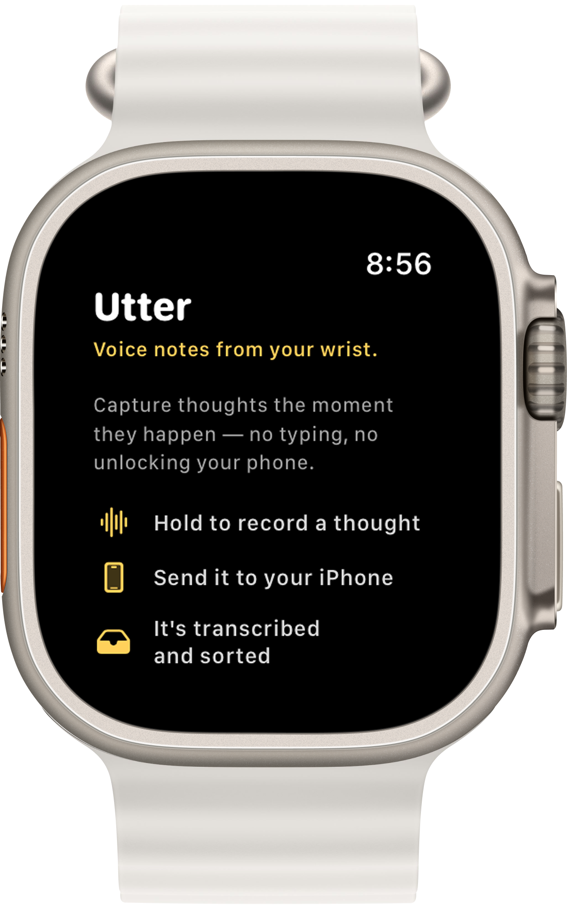
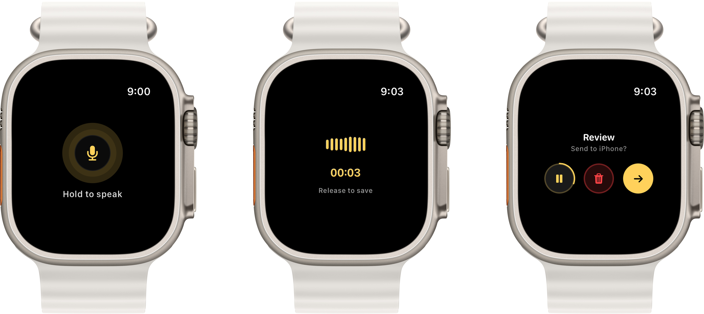
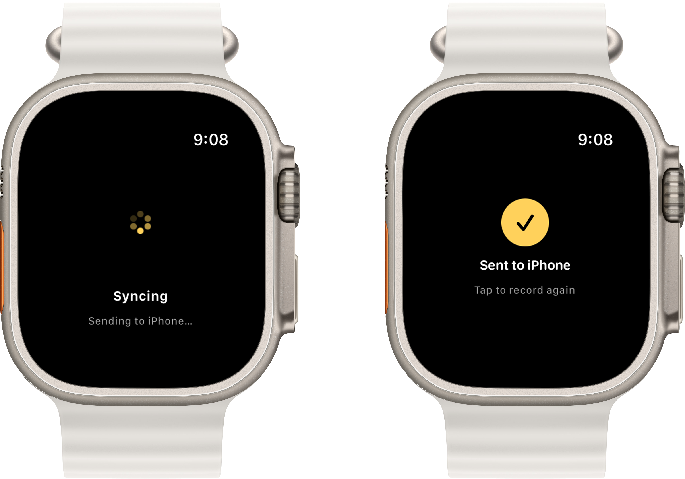
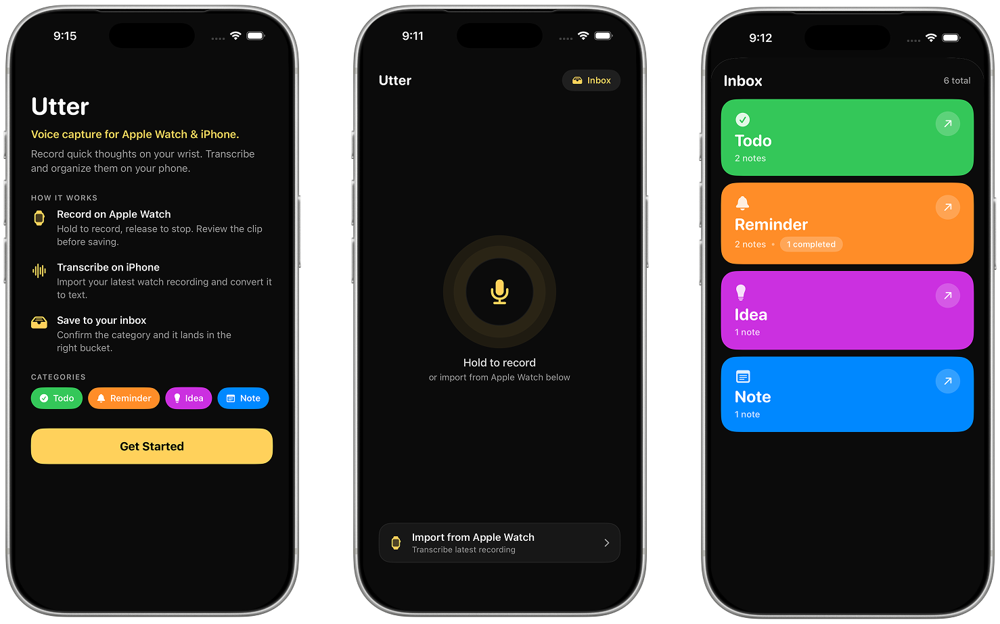

<p align="center">
  
</p>

<h1 align="center">Utter</h1>

<p align="center">
  A voice capture app for Apple Watch and iPhone.<br/>
  Record quick thoughts on your wrist. Transcribe and organize them on your phone.
</p>

<p align="center">
  
  
  
</p>

---

## What it does

Utter is built around a simple idea — the fastest way to capture a thought is to say it out loud. Hold a button on your Apple Watch, speak, and release. That recording gets sent to your iPhone where it's transcribed and automatically sorted into one of four categories based on what you said.

No typing. No unlocking your phone. Just speak and it's saved.

---

## Demo

### Watch app

<p align="center">
  
</p>

### iPhone app — transcribe & organize

<p align="center">
  
</p>

---

## App screens

### Watch — intro, recording & review

<p align="center">
  
  &nbsp;&nbsp;
  
  &nbsp;&nbsp;
  
</p>

### iPhone — full workflow

<p align="center">
  
</p>

---

## How it works

1. **Record on Apple Watch** — Hold the screen to record, release to stop. Review the audio clip before sending.
2. **Send to iPhone** — Tap the arrow to transfer the recording via WatchConnectivity.
3. **Transcribe** — On iPhone, tap "Import from Apple Watch" to convert the audio to text using on-device speech recognition.
4. **Review and save** — Check the transcript, confirm or change the category, then save it to your inbox.
5. **Inbox** — Browse notes grouped by category. Tap a category to open it, check items off, or delete them.

---

## Categories

| | Category | Used for |
|---|---|---|
| 🟢 | **Todo** | Tasks and actions |
| 🟠 | **Reminder** | Time-based follow-ups |
| 🟣 | **Idea** | Concepts and brainstorms |
| 🔵 | **Note** | Everything else worth keeping |

Auto-detection is keyword-based. Phrases like "remind me", "tomorrow", "call" → Reminder. "Buy", "pick up", "do" → Todo. "Idea", "what if", "build" → Idea. Everything else → Note.

---

## Design process

Early sketches exploring different UI directions for the watch app before landing on the final design.

<p align="center">
  
</p>

---

## Tech stack

- **SwiftUI** — iOS + watchOS UI
- **WatchConnectivity** — Watch → iPhone audio file transfer
- **AVFoundation** — Audio recording and playback
- **Speech framework** — On-device transcription
- **UserDefaults** — Local memo persistence

---

## Requirements

- iOS 17+
- watchOS 10+
- Xcode 15+
- Apple Watch paired to iPhone (for full transfer flow)

---

## Project structure

```
Utter/
├── Utter/                          # iPhone app
│   ├── ContentView.swift           # Main UI — recording, inbox, review sheet
│   ├── VoiceMemo.swift             # Data model
│   ├── SpeechManager.swift         # Recording + transcription
│   ├── UtterApp.swift              # App entry + PhoneConnectivityManager
│   └── Color+Hex.swift             # Hex color helper
│
└── UtterWatch Watch App/           # Watch app
    ├── ContentView.swift           # Watch UI — idle, recording, review, confirmed
    ├── WatchAudioRecorder.swift    # Audio recording + playback
    └── UtterWatchApp.swift         # App entry + WatchConnectivityManager
```

---

## Setup

1. Clone the repo
   ```bash
   git clone https://github.com/ritikajoshi/utter.git
   ```
2. Open `Utter.xcodeproj` in Xcode
3. Select your development team in **Signing & Capabilities** for both the `Utter` and `UtterWatch Watch App` targets
4. Build and run on a real device — microphone access and WatchConnectivity require physical hardware for the full flow

---

## Developer notes

- **Simulator testing** — WatchConnectivity `transferFile` does not work between simulators. To test transcription in the simulator, manually copy a `.m4a` file into the app's `Documents/utter-recordings/` folder.
- **File naming** — Watch recordings must be named `utter-<UUID>.m4a` to be picked up by `latestWatchRecordingURL()`.
- **Category detection** — Lives in `detectedCategory(for:)` in `ContentView.swift`. Reminder keywords are checked first to avoid false Todo matches on phrases like "remember to".
- **Persistence** — Memos are stored in `UserDefaults` under the key `utter_saved_memos` as JSON-encoded `[VoiceMemo]`.

---

<p align="center">
  Built by <strong>Ritika Joshi</strong> · 2026
</p>
